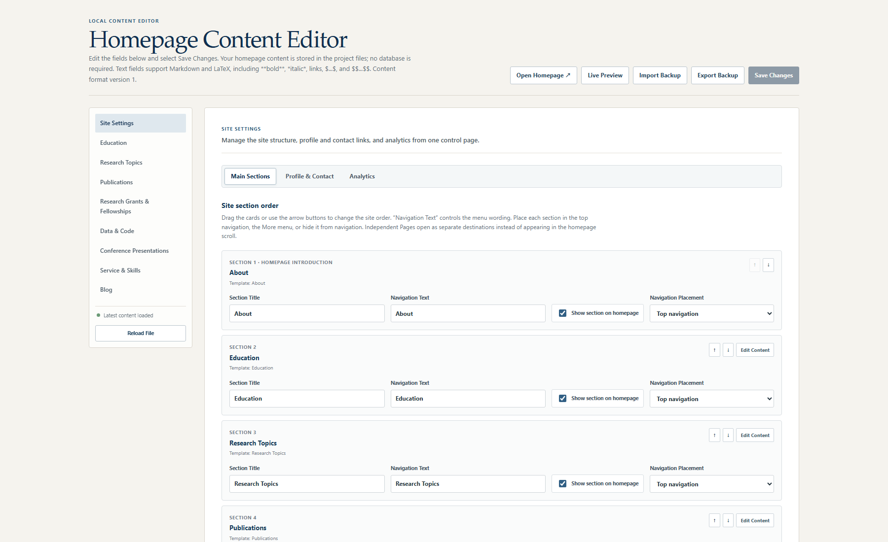

<div align="center">

# ScholarCanvas

**使用可视化编辑器构建和维护你的学术主页。**

_在一个本地工作区中编辑论文、栏目、独立页面和文件。_

<a href="./README.md"></a>

<a href="https://yxb-cn.github.io/scholarcanvas/" target="_blank" rel="noopener noreferrer">模板演示 ↗</a> · <a href="https://yxb-cn.github.io/" target="_blank" rel="noopener noreferrer">作者主页 ↗</a> <em>（即将上线）</em> · <a href="#快速开始">快速开始</a>

[](LICENSE)    

</div>

<p align="center">
  
</p>

<p align="center"><sub>大屏幕和手机视图均由同一份内容文件生成。</sub></p>

ScholarCanvas 将学术主页仓库转变为一个可视化工作区：编辑内容、实时查看响应式页面，并发布纯静态 GitHub Pages 网站，无需手动修改组件或计算仓库网址。

## 为什么选择 ScholarCanvas？

| 功能 | 价值 |
| --- | --- |
| **与仓库原生结合的可视化编辑器** | 无需手动修改组件，即可编辑个人资料、论文、导航、照片、CV 文件和自定义栏目。所有修改都会写回普通仓库文件，可审查、可进行版本管理、也可直接提交。 |
| **电脑端和手机端实时预览** | 在编辑器内切换设备宽度，立即查看尚未保存的修改。写入磁盘前即可检查导航、字体、照片和长文本。 |
| **单一且带版本号的内容源** | `content/site-content.json` 同时控制学术内容和主页结构，文档与独立页面资源则保存在规则清晰的文件夹中。 |
| **为研究人员设计的论文工作流** | 可折叠较长的论文表单、在不同状态之间拖动论文、标记通讯作者、控制显示状态，并编写支持 Markdown/LaTeX 的摘要。还可一次性导入完整 `.bib` 文件，并保留期刊、卷、期、页码和年份信息。 |
| **灵活且由模板驱动的栏目** | 可调整栏目顺序、选择导航位置，也可以复用已有布局创建 Teaching、Awards、Work Experience、Courses 和 Blog 等栏目。 |
| **无需离开编辑器即可编写长页面** | 编写或导入 Markdown、预览 LaTeX、自动生成目录，并为每个条目在独立文件夹中上传图片或 PDF。 |
| **自动识别 GitHub Pages 网址** | 部署工作流会识别 Pages 地址和仓库子路径，并自动应用到资源链接、规范网址、站点地图和搜索元数据，同时支持 `username.github.io` 根站点和项目站点。 |
| **Windows 与 macOS 一键启动** | 双击 `Open Homepage Editor.cmd` 或 `Open Homepage Editor.command`。启动器会在首次使用时安装依赖、识别当前项目文件夹、复用已运行的编辑器，或自动选择下一个可用端口，并打开正确页面。 |
| **发布前自动检查** | 每次保存都会验证内容，并检查 Git 实际能够发布的文件。编辑器会显示可纳入仓库的文件数量与大小，确认本地依赖已经排除，并阻止未忽略的构建目录、被跟踪的敏感文件或超过 GitHub 限制的文件。 |

## 可视化内容编辑器

### 编辑器概览



### 实时预览——电脑端


### 实时预览——手机端


本地编辑器会直接写入 `content/site-content.json`，并在仓库中管理个人照片、CV 文件和独立页面资源。部署后的网站仍然是静态且只读的。

编辑器包括：

- 一个 Site Settings 区域，用于管理网站结构、个人资料、联系链接和可选的 Umami Analytics；
- 对主页主栏目的新增、删除、重命名、排序、显示、隐藏和导航位置控制；
- 用于新增学术或职业内容的可复用栏目模板；
- 在不同论文状态之间拖放论文；
- 可折叠的论文表单、批量 `.bib` 导入、BibTeX 解析、支持 Markdown/LaTeX 的摘要以及逐篇论文显示控制；
- 保存前即可更新的电脑端和手机端主页实时预览；
- 相互独立的 4:5 主页照片裁剪和方形导航头像裁剪；
- 备份导入与导出，以及对必填字段、网址、邮箱、搜索描述和 CV 路径的检查；
- 带实时预览的独立页面 Markdown 编辑器；
- 文件夹、ZIP、Markdown、图片和 PDF 导入，并自动生成资源路径；
- 每次保存时自动执行 GitHub 上传检查，包括可发布文件数量和大小、被忽略的本地依赖、敏感文件和超大文件；
- 自动清理由编辑器生成但已经不再使用的个人照片和页面文件。

> **隐私提示：**“Hidden from page”并不代表私密。部署后，仓库内容、上传的文件和 `site-content.json` 仍然公开。

## 快速开始

### 1. 创建你的仓库

选择 **Use this template** 可获得干净的 Git 历史；如果希望保留与上游仓库的可见关联，也可以选择 **Fork**。请先把新仓库克隆到最终使用的文件夹，再打开编辑器。

### 2. 打开编辑器

在 Windows 上双击：

```text
Open Homepage Editor.cmd
```

在 macOS 上双击：

```text
Open Homepage Editor.command
```

如果 macOS 在复制文件夹时移除了可执行权限，请先运行一次 `chmod +x "Open Homepage Editor.command"`，之后即可正常双击打开。

第一次运行会安装所需软件包，通常会打开：

```text
http://127.0.0.1:3001/editor/
```

如果端口 `3001` 已被另一个 ScholarCanvas 项目或其他程序占用，编辑器会自动选择下一个可用端口。再次打开同一个项目时，会复用已经运行的本地服务，而不是重复启动。

在 Windows、macOS 或 Linux 上，对应的终端命令是：

```bash
pnpm install
pnpm editor
```

需要 Node.js 22.13 或更高版本。编辑时请保持终端或命令窗口处于打开状态。

### 3. 替换演示内容

在编辑器中：

1. 更新个人资料、Biography、联系链接、Education、Research、Publications、Projects、Code、Talks 和 Service；
2. 上传个人照片，并分别保存主页照片和导航头像裁剪；
3. 替换 `public/documents/` 中的示例 CV；
4. 删除或改写示例 Blog 页面；
5. 更新 Browser Title 和 Search Description；
6. 保持 Analytics 关闭，或者填写你自己的 Umami 配置；
7. 点击 **Save Changes**。

内容的唯一真实来源是 `content/site-content.json`。编辑器会保存到该文件以及 `public/` 下的相关文件夹。

每次保存还会运行 **GitHub upload check**。当它显示 **Ready** 时，提交 GitHub Desktop 中显示的全部修改即可。不要通过 GitHub 网页直接上传整个本地文件夹：已经安装的软件包和构建缓存只保留在你的电脑上，并会被自动排除。

### 4. 检查并发布

```bash
pnpm check
git add .
git commit -m "Customize academic homepage"
git push
```

在 **Settings → Pages** 中启用 **GitHub Actions**。每次推送到 `main` 后，仓库中包含的工作流都会构建并发布静态网站。最终的 GitHub Pages 地址会在部署时自动识别，并用于规范链接、站点地图和搜索元数据。

软件代码可依据 MIT License 复用。演示内容和资源在 [CONTENT_NOTICE.md](CONTENT_NOTICE.md) 中单独说明，在发布个人网站前应予以替换。

## 文件和文件夹

| 路径 | 用途 |
| --- | --- |
| `app/` | 主页、内容渲染器、编辑器、验证规则和栏目注册表 |
| `content/site-content.json` | 带版本号的可编辑内容 |
| `public/documents/` | CV 和其他公开文档 |
| `public/images/` | 原始个人照片和生成的裁剪图片 |
| `public/page-content/<section>/<page>/` | 每个独立页面一个文件夹，其中包含 `index.md`、图片和 PDF |
| `public/screenshots/` | README 和文档截图 |
| `tools/` | 仅在本地运行的内容、Markdown、图片和照片保存接口 |
| `.github/` | Pull Request 检查、Pages 部署和贡献模板 |

Git 会忽略生成的构建目录、临时渲染文件和本地图像生成输出。

## 照片和文档

照片编辑器会把上传的原始图片保存在 `public/images/` 中，同时创建用于主页和固定导航栏的优化裁剪图。每次保存时，内容文件已经不再引用的哈希个人图片会被自动删除。

CV 按钮目前使用：

```text
/documents/Your_Name_CV.pdf
```

对应的 LaTeX 源文件是 `public/documents/Your_Name_CV.tex`。你可以编辑并编译该文件，也可以直接替换 `public/documents/Your_Name_CV.pdf`，无需修改网站链接即可更新文档。

部署后，`public/` 中的所有内容都会公开。从主页中隐藏某个条目，并不会让底层数据或文件变成私密内容。

## 内容格式与栏目模板

内容文件中包含 `schemaVersion`。编辑器会在保存前迁移较旧的备份。

`app/section-registry.ts` 是所有主栏目模板的集中定义。每个条目都声明显示名称、编辑方式、默认项目和页面渲染器。贡献者新增 Teaching、Awards 或 Work Experience 时，应从这里开始，而不必在整个项目中追踪分散的配置。

**Independent Pages** 模板适用于从单页主页跳转出去的导航目标。它会生成紧凑的逐行索引，并为每个条目创建一个 Markdown/LaTeX 详情页。使用 `#`、`##` 或 `###` 编写的标题会自动变成详情页左侧目录。

在本地编辑器中打开 Independent Pages 条目，即可使用专门的 Write/Split/Preview 工作区。上传文件之前，请先给条目填写 Page Slug。之后可以：

- 同时导入一个 Markdown 文件以及相关图片或 PDF；
- 导入完整文件夹并保留相对文件路径；
- 导入包含 Markdown、图片和 PDF 的 ZIP；
- 把支持的文件直接粘贴或拖入写作区域；
- 使用 **Add File** 上传 JPG、PNG、WebP、GIF 或 PDF。

文件上传后，编辑器会自动插入适当的 Markdown 图片或下载链接。它还会显示最终的公开文件路径，并提供 **Copy path** 按钮，因此同一个附件可以在页面其他位置再次引用。

每个条目拥有一个独立文件夹：

```text
public/page-content/<section-id>/<page-slug>/
├── index.md
├── figure-name-<hash>.png
└── paper-name-<hash>.pdf
```

上传第一个文件时会自动创建该文件夹。点击 **Save Changes** 会把 `index.md` 写入同一个文件夹。这些文件应该与仓库其他内容一起提交。保存时还会删除已经不再引用的文件和文件夹，因此删除页面后不会留下旧资源。使用旧版 `content/pages/` 和 `public/page-assets/` 结构保存的内容，会在下一次保存时自动迁移。

## Markdown、LaTeX 与语言

可编辑文本支持 `**bold**`、`*italic*` 和 `[links](https://example.com)` 等 Markdown 语法，同时支持行内公式和展示公式：

```text
$R_{t+1} = \alpha + \beta x_t + \varepsilon_{t+1}$

$$
\hat{\beta} = (X^\top X)^{-1}X^\top y
$$
```

项目使用 UTF-8，可以混合显示英文、中文、带重音字符和数学符号。

## 可选的 Umami Analytics

Analytics 是可选配置；为确保模板 Fork 后保持干净，默认处于关闭状态。在本地编辑器中打开 **Analytics**，填写 Umami 跟踪代码中显示的值：

- **Enable Analytics**
- **Provider:** Umami
- **Script URL**
- **Website ID**

只有在启用 Analytics 且两个值均已填写时，跟踪脚本才会被加入导出的网站。Website ID 和 Script URL 是公开的浏览器配置；绝不要把 Umami 密码、API Key 或 Access Token 粘贴进内容文件。

## 检查与构建

需要 Node.js 22.13 或更高版本。

```bash
pnpm install
pnpm lint
pnpm build
```

生产构建会作为静态网站写入 `out/`。Pull Request 会自动运行 `pnpm check`。

如果想删除生成的预览和构建文件夹，同时保留已安装的依赖和源文件，可以运行：

```bash
pnpm clean
```

## 使用 GitHub Pages 发布

1. 创建 GitHub 仓库并上传本项目；
2. 保持默认分支名称为 `main`；
3. 打开 **Settings → Pages**；
4. 在 **Build and deployment** 中选择 **GitHub Actions**；
5. 推送到 `main`，或者手动运行 **Deploy to GitHub Pages**。

部署工作流同时支持 `username.github.io/repository-name/` 形式的项目站点和 `username.github.io/` 形式的根站点。你不需要在内容编辑器中计算或填写该地址。通过其他工作流或托管服务手动构建时，可以使用 **Published Site URL (optional override)**。

如果希望其他人通过 GitHub 的 **Use this template** 按钮使用本项目，请在仓库创建后同时启用 **Settings → General → Template repository**。

## 常见问题

### “Hidden”是私密的吗？

不是。Hidden 只会让内容不出现在渲染后的主页中，它仍然存在于公开仓库和内容 JSON 中。

### Search Description 是什么？

它是搜索引擎和社交平台可能显示在页面标题旁边的简短摘要。使用“Search Description”这类占位文本会让搜索结果显得尚未完成，因此编辑器会在保存前发出提醒。

### 部署后的网站需要服务器或数据库吗？

不需要。GitHub Pages 会提供导出的 HTML、CSS、JavaScript、图片、JSON 和 PDF 文件。可写的保存接口只在本地运行。

### 以后如何更新网站？

打开本地编辑器、保存新内容、提交发生变化的文件，然后推送到 GitHub。GitHub Pages 会自动部署更新。

### 是否需要填写 GitHub Pages 网址？

不需要。内置 Pages 工作流会自动识别根站点、项目站点和已经配置的 Pages 地址。只有通过其他工作流或托管服务构建网站时，才需要使用可选的 Published Site URL 字段。

### 如果端口 3001 已被占用怎么办？

ScholarCanvas 会检查每个正在运行的本地编辑器属于哪个项目。如果当前项目的服务已经存在，它会直接重新打开该服务；否则会选择下一个可用端口，并自动打开正确的编辑器。

### 错误修改后可以恢复吗？

保存前可以导入此前导出的 JSON 备份。文件提交后，Git 历史还会提供另一层恢复机制。

### 可以加入 Analytics 吗？

可以。在本地编辑器中打开 **Analytics**，粘贴 Umami 提供的 Script URL 和 Website ID，打开 **Enable Analytics** 后保存。模板默认关闭，因此 Fork 仓库的人不会把数据发送到原作者的 Umami 账户。

## 许可证与来源说明

本仓库代码采用 MIT License。个人演示内容和资源在 [CONTENT_NOTICE.md](CONTENT_NOTICE.md) 中单独说明。

欢迎贡献。请参阅 [CONTRIBUTING.md](CONTRIBUTING.md)、[SECURITY.md](SECURITY.md) 和 [CODE_OF_CONDUCT.md](CODE_OF_CONDUCT.md)。
